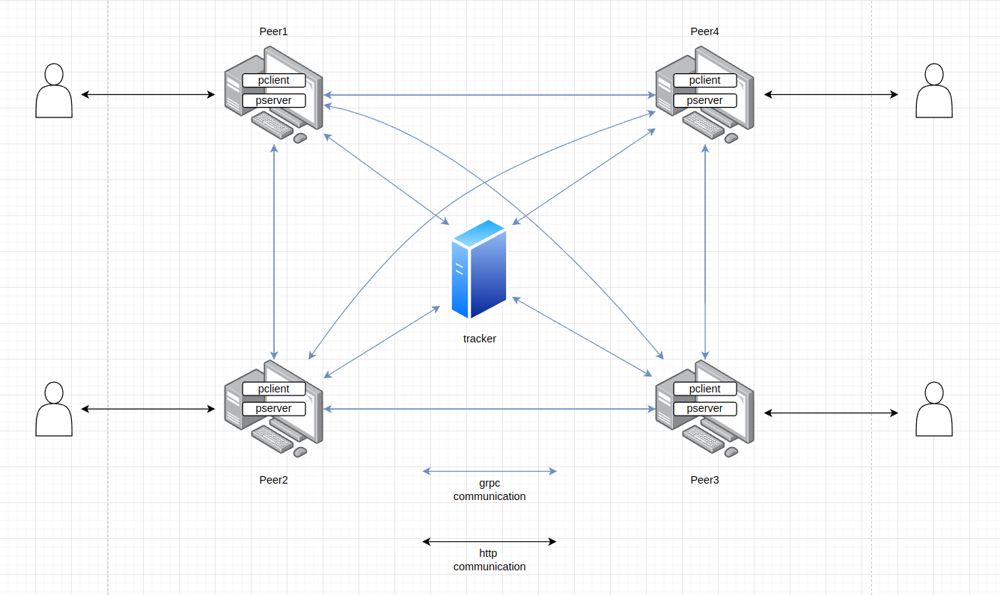

# Info de la materia: ST0263 Tópicos especiales de telemática

# Estudiante(s): Gian Paul Sánchez Aristizábal, gpsancheza@eafit.edu.co

# Profesor: Alvaro Ospina, aeospinas@eafit.edu.co

# Reto 1 y Reto 2

# 1. Breve descripción de la actividad

## 1.1. Que aspectos cumplió o desarrolló de la actividad propuesta por el profesor (requerimientos funcionales y no funcionales)
Desarrollé un sistema de transmisión de archivos (dummy) que sigue una arquitectura P2P. Para esto implementé un servidor tracker que responde de manera concurrente a las peticiones de múltiples peer, esta comunicación se da usando el protocolo grpc, y entre las peticiones permitidas se encuentran: 
- login: Permite registrar a un peer dentro de la red.
- index: Permite registrar los archivos que el peer manda en la solicitud.
- search: Busca el peer que cuenta con el archivo solicitado en la petición.
- logout: Expulsa a un peer que se encuentra en la red.

A su vez, desarrollé un componente peer (que luego es replicado en una misma red usando docker) que tiene la capacidad de realizar y responder peticiones a otros componentes de la misma red. Los componentes peer dentro de una red tienen la capacidad de responder a peticiones http y grpc. Las peticiones http son las que haría el usuario (en este caso el profeso) a través de postman hacia un peer con el fin de que este realice un acción, entre estas peticiones tenemos:
- download: Permite al usuario indicar al peer que archivo descargar y ya este se encarga de todo.
- upload: El usuario indica al peer el archivo que quiere subir y a que otro peer se lo quiere subir.

Podemos ver entonces que las peticiones http fueron implementadas para permitir al usuario interactuar con la red. Luego, la comunicación del peer con demás componentes los demás peers de la red se hace a través de peticiones usando el protocolo grpc, las peticiones que estos pueden hacer son:
- download: Permite a un peer descargar archivos de otro peer.
- upload: Permite a un peer subir archivos a otro peer.

## 1.2. Que aspectos NO cumplió o desarrolló de la actividad propuesta por el profesor (requerimientos funcionales y no funcionales)

Ninguno

# 2. información general de diseño de alto nivel, arquitectura, patrones, mejores prácticas utilizadas.

Se maneja una arquitectura de red Peer to Peer que se encuentra no estructurada debido a su comportamiento "aleatorio" a la hora de instanciar Peers y centralizada debido a que depende en mayor medida de una servidor central el cual tiene información indispensable para el funcionamiento adecuado del sistema.

Se realizó un desarrollo teniendo en cuenta prácticas como:
- KISS: Se implemento el programa teniendo en cuenta que el código no se volviera complejo y que fuera fácil de entender en caso de que el profesor lo tuviera que revisar a fondo.

- DRY: Se intentó evitar repeticiones de código a toda costa para que este fuera más fácil de mantener, más legible y escalable.

- YAGNI: Durante el desarrollo no se escribía código "para un futuro", sino que se programaba lo justo y necesario en el momento.

- Boy Scout: A pesar de ser un proyecto individual, diría que se fue una buena práctica que adopté debido a que cada que entraba al código a seguir desarrollando y observaba que algo se podía hacer mejor, me ponía en la tarea de hacerlo.

# 3. Descripción del ambiente de desarrollo y técnico: lenguaje de programación, librerias, paquetes, etc, con sus numeros de versiones.

## ¿Cómo se compila y ejecuta?

### Setup del sistema

Si queremos trabajar en el proyecto como desarrolladores debemos de seguir las siguientes instrucciones.  
Después de haber clonado el repositorio, para ejecutar el programa debemos instalar todas las dependencias necesarias tanto del lado del tracker como del lado del peer. Para esto, ingresaremos a ambas carpetas tanto "tracker" como "peer" y ejecutaremos: ***npm i***. Esto hará que se descarguen e instalen todas esas dependencias necesarias para el funcionamiento de ambos componentes.

### Ejecución del sistema

Para ejecutar el programa en el entorno de desarrollo lo podemos hacer de dos maneras: ***npm run dev*** o ***npm start***. La primera nos sirve en caso de estar haciendo modificaciones al código mientras observamos el comportamiento que va teniendo el sistema, es decir, nos sirve para debuggear ya que cualquier cambio en el código se ve reflejado en la ejecución del sistema de inmediato, por otro lado, la segunda opción solo sirve para ejecutar el código con base en como está en el momento de la ejecución, es decir, si hacemos cambios cuando ya se puso en ejecución no vamos a ver reflejados los cambios sino hasta que reiniciemos el proceso.

## Detalles del desarrollo

Todo buen desarrollo comienza con la planeación del la arquitectura de modo que fuera claro los componentes e interacciones necesarios en en el sistema. Luego, se comenzó a codificar el mismo usando herramientas mencionadas en el siguiente punto. Luego, se empezó a implementar todas las funcionalidades que tenía el servidor central (tracker) y estas eran probadas una por una usando postman a través de peticiones HTTP en un pueto de la máquina local del desarrollador, es decir, allí aún no había sido implementado el protocolo grpc para la comunicación de los microservicios, ni se habían virtualizado máquinas.

Después de comprobar que el comportamiento de las funcionalidades del servidor central era el esperado, se siguió con la implementación del pŕotocolo grpc en el servidor, de modo que ya no se le hicieran peticiones HTTP a este, sino peticiones grpc. Se probó que todo estuviera bien del lado del servidor y se dió por completado el desarrollodel servidor central.

Seguidamente, se comenzó con la implementación del peer (el cuál sería el código replicado en múltiples máquinas para simular una red de varios computadores), para esto primero se debía crear el otro extremo de conexión con el servidor central, es decir hacer que el peer se comportara como cliente del servidor central. Después de ello, se pasó a realizar las funcionales del peer como servidor y del peer como cliente de otros peers de la red. Por último, se realizó el apartado desde el cuál los usuarios finales podrían acceder desde postman a las funcionalidades disponibles del peer (las cuales fueron mencionadas en numerales anteriores).

Finalmente, cuando ya se tenía todo el código de ambas entidades (tanto peer como tracker) totalmente desarrollado, se pasó a crear los archivos de docker necesarios para permitir la creación y virtualización de una red P2P, y se ejecutaron los comandos necesarios para esta tarea, como la creación de imagenes y subida de imagenes a DockerHub.

## Detalles técnicos

El proyecto fue desarrollado usando NodeJS junto con el framework ExpressJS el cuál sirvió para crear todos aquellos microservicios necesarios dado que son herramientas de programación ampliamente usadas en el desarrollo backend de las aplicaciones y permiten cumplir todos los requisitos pedidos en esta entrega. Se adoptó el framework de comunicación grpc para la comunicación entre microservicios del sistema y el protocolo http para la comunicación entre los peers y el usuario final. Además, el proyecto implementa herramientas de virtualización como docker para su correcto funcionamiento.

## Descripción y cómo se configura los parámetros del proyecto (ej: ip, puertos, conexión a bases de datos, variables de ambiente, parámetros, etc)

No es necesario configurar ningún parámetro para le ejecución del código en el ambiente de desarollo, aún así, se debe tener en cuenta que el comportamiento entre peers puede resultar díficil de simular debido a que no estaríamos haciendo una virtualización, sino que se está ejecutando todo en la misma máquina.

## Detalles de la organización del código por carpetas o descripción de algún archivo

El código está dividido en dos carpetas, la carpeta *peer* la cual tiene todo lo relacionado con los nodos peer y la carpeta *tracker* la cual tiene todo lo relacionado con el servidor de Directorio y Localización (también llamado tracker). Cada una de estas carpetas es un proyecto de nodeJS distinto, es decir, cada una depende de distintas dependencias y tiene archivos disintos de los que depender, estas no se mezclan, o en otras palabras, un archivo de una carpeta no puede llamar a archivos de la otra (se tratan como microservicios).

# 4. Descripción del ambiente de EJECUCIÓN (en producción) lenguaje de programación, librerias, paquetes, etc, con sus numeros de versiones.

# IP o nombres de dominio en nube o en la máquina servidor.

Debido a que el sistema está corriendo en varias máquinas de Docker, tenemos dos meaneras en las cuales nos podemos conectar para hacer consultas:

- Identificar el puerto al que está enlazado el contenedor de docker del peer al que se quiere consultar. Esta información de los puertos se puede observar en el archivo docker-compose.yaml de la carpeta "peer", aún así listaremos los puertos a continuación para mayor facilidad:

    - Peer1 -> 3000
    - Peer2 -> 3001
    - Peer3 -> 3002
    - Peer4 -> 3003

    En caso de usar los puertos de los contenedores como manera de conexión tendremos que hacer las peticiones a localhost (ya que es aquí donde están corriendo todas las máquinas de docker)

- Identificar la dirección ip del contenedor de docker del peer al que se quiere consultar. Esta información de las direcciones ip se puede observar en el arechivo docker-compose.yaml de la carpeta "peer", aún así listaremos las direcciones ip a continuación para mayor facilidad:

    - Peer1 -> 172.20.0.2
    - Peer2 -> 172.20.0.3
    - Peer3 -> 172.20.0.4
    - Peer4 -> 172.20.0.5

    En caso de usar las direcciones ip como manera de conexión tendremos que apuntar al puerto 3000 (ya que los contenedores internamente están corriendo el programa en este puerto)

El tracker no se encuentra en esta sección debido a que nosotros como usuario final no podemos acceder a este.

## Descripción y como se configura los parámetros del proyecto (ej: ip, puertos, conexión a bases de datos, variables de ambiente, parámetros, etc)

Toda las opciones ya están configuradas para que si se quiere ejecutar el sistema solo se tengan que seguir los pasos listados en el siguiente, sin embargo, en caso de querer cambiar los nombres, la red, las direcciones ip, puertos y las imagenes a las que hacen referencia los contenedores de docker debemos acceder al archivo docker-compose.yaml y hacerlo desde allí ya que aquí se encuentran las configuraciones generales de estos.

## ¿Cómo se lanza el servidor?

Debido a que el proyecto utiliza docker para su ejecución ya se encuentran cargadas las imagenes en DockeHub, por esto no se necesita descargar e instalar ninguna ninguna dependencia, lo que hay que hacer es lo siguiente:

1. Instalar docker en nuestra máquina e instalar la herramienta docker-compose.

2. Bajar las imagenes de DockerHub para poderlas ejecutar en nuestra máquina. Para esto podemos ejecutar los siguientes comandos:
    - ***docker pull giansz/tracker:latest***
    - ***docker pull giansz/peer:latest***

3. Luego, se debe crear una red de docker en donde van a existir neustros contenedores de docker (es decir, nuestros peers y tracker). Para esto hacemos:
    - ***docker network create --subnet=172.0.0.0/16 mynet***

4. Después de esto creamos el contenedor de docker que va a tener a nuestro tracker, para conseguirlo nos debemos posicionar en la carpeta "tracker" y ejecuramos un docker-compose así:
    - ***docker-compose up -d***

5. Después de esto vamos a crear los peers, para lograrlo nos iremos a la carpeta "peer" y ejecutaremos el mismo comando del punto anterior:
    - ***docker-compose up -d***

## Una mini guía de como un usuario utilizaría el software o la aplicación

Después de realizar todos los pasos anteriores el sistema debió haber quedado corriendo y listo para ser utilizado. Para interactúar con el sistema se hará a través de postman (o cualquier otra aplicación diseñada para hacer consultas a servidores, ej: insomnia), allí, podremos hacer consultas a los peers los cuales se están ejecutando en un segundo plano en nuestra máquina. 

Las consultas que se pueden hacer a los peer fueron descritas en el punto 1.1, y las direcciones (o puertos) fueron descritas en la primera parte de esta sección.

Si se quiere ver el flujo del programa (los logs que son imprimidos dentro de los contenedores) podríamos hacerlo ejecutando el comando *logs* de docker, el cuál nos permite ver las impresiones que se han hecho en la consola del contenedor (ya sea de un peer o tracker). El comando completo se vería algo así: ***docker logs -f [id_del_contenedor]***

# 5. Otra información que considere relevante para esta actividad.

# Referencias
- https://grpc.io/docs/what-is-grpc/introduction/
- https://blog.logrocket.com/creating-a-crud-api-with-node-express-and-grpc/